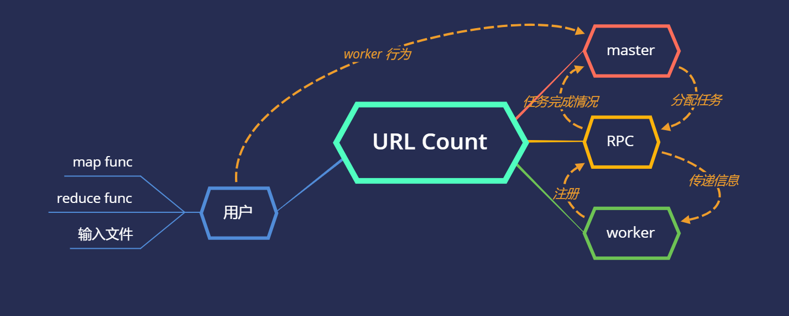
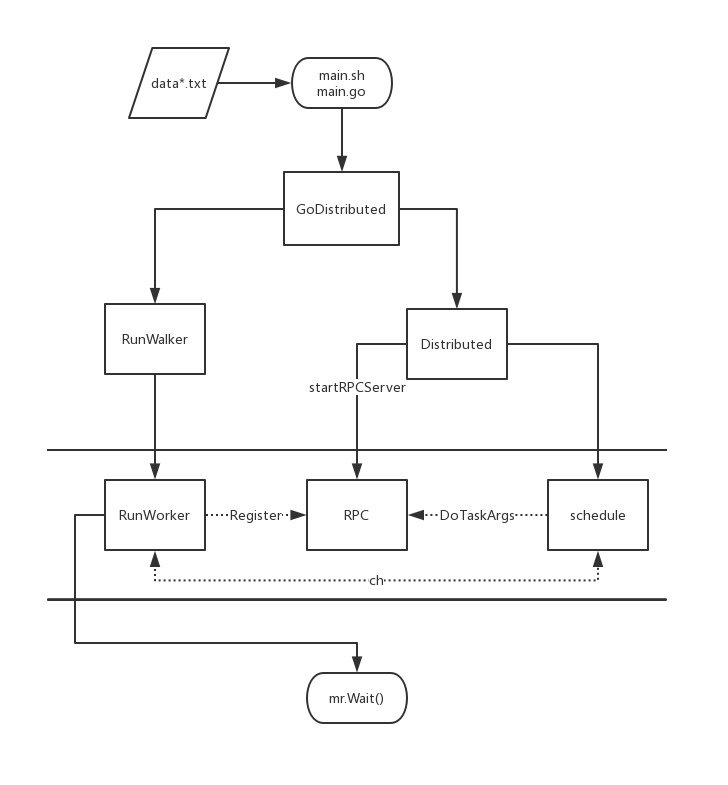

# URL_counter_mapreduce

PingCap interview

使用说明和详设在 `usage&design.md` 中

## 架构说明

注：本程序所有的分布式情况均使用多线程进行模拟

1. 面向用户
    1. 文件输入要求
        为多个文件且每个均不超过128MB（数值取自Hadoop2.0）加起来可以达到10GB

    2. map/reduce
       1. map
            将每个URL扩展成为{key, value}的键值对，其中key为url本身，value为1表示出现一次。将处理的所有的键值对根据key进行排序并依据reducer的数量进行划分，产生中间文件

       2. reduce
            合并相邻的相同的URL，最终其value的值即为这个URL在所有的文件中出现的次数。因为在map阶段对key的集合进行了划分，所以不存在相同的key值分布在不同reducer上的情况。

2. master 节点
    主线程，同时作为 rpc 线程的主机，负责任务调度和监控，同时。与 worker 节点所有的调用都是通过 rpc 服务进行的，避免了调用失败时阻塞主线程的情况。
3. RPC  
    作为 master 和 worker 的中间层，负责向双方传递消息，所有的 rpc 调用都是异步的。本质是 rpc.Dail 通过双方的 **rpc 地址**进行信息交换。
4. worker 节点  
    单独的线程，向 rpc 主机进行注册并汇报任务完成情况。对 worker 线程的调用也是异步的。

## 主调用流程

## 每日总结

- 2.12  
    明确目标是计算10GB的数据中出现次数top100的URL，但是可用的内存只有1GB，显然需要使用外存，迅速想到之前接触过的mapreduce。在MIT 6.824的课程中曾经进行过word count的实现，且在mapreduce的论文中明确提到这样的技术可以进行URL count
    复习了论文并选择6.824的lab 1作为code base，主要使用其的单元测试和线程间调用部分
    完成6.824 lab 1的map/reduce部分并通过其单元测试
- 2.13  
    完成lab 1的其余部分，包括单一worker的word count和分布式情况下worker调用，并通过其单元测试。（分布式通过rpc进行模拟）
  - 改进schedule的任务分配部分。取消了任务分配通道(chan)的缓存，通过两方都准备好才发生通信的特性完成任务分配
  - 改进schedule的线程同步部分。通过统计成功完成的任务数量避免使用sync.WaitGroup()，简化程序结构
- 2.14  
    改动map部分以适应本次URL统计的需求。将每个URL作为统计的唯一键值，并生成测试数据，共八个文件，其中每个里面包含10000个随机生成的URL，为确保可以有重复的部分，统一使用3位(`https://www.xxx.com`)。顺利通过单一worker的测试，生成的数据中出现最多的URL出现了16次，期望为4.55次
    在进行分布式测试时发现在schedule中出现死循环，经过go race测试，发现在分配任务到每个worker时稳定出现线程阻塞情况，且每个线程均有相同情况
  - 没有成功debug
- 2.15  
    上午通过打log的方式推测其中call函数在包装rpc.Dial时出现问题，在同步调用时因为某些问题导致阻塞，使主线程处于挂起状态，但是在查阅文档后发现此处正常
    下午继续尝试发现此处的阻塞产生于registerChan中没有数据导致所有的线程都在等待通道内容（即worker的rpc地址）。
    通过调用检测发现此处产生了死锁: 产生于schedule(mapreduce/schedule.go)和forwardRegistrations(mapreduce/master.go)
  - schedule要求有机器地址，待任务完成后将机器重新注册到master处
  - forwardRegistrations要求在master注册的可用机器数量大于0时才会分配机器的地址
  - 解决方案：在schedule进行任务分配之前对所有worker线程在master处进行注册

  ===> **不仅要关注函数的运行时情况，还要关注初始化**
- 2.16  
    完成所有代码部分并通过分布式的测试  
    **反思：** 在进行分布式的单元测试时只关注了工作线程之间有没有相互影响，忽视了工作线程的开启（在单元测试的线程开始部分默认已经分配好了工作，没有涉及schedule部分）
    完善文档
- 2.17  
    完成使用说明和详设的文档，开始写架构说明部分
- 2.18  
    完成全部文档，包括 readme 和 代码注释